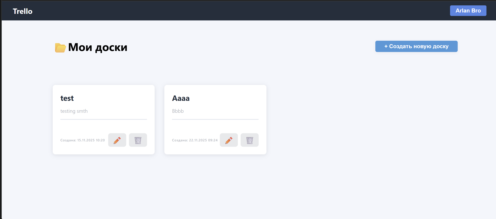
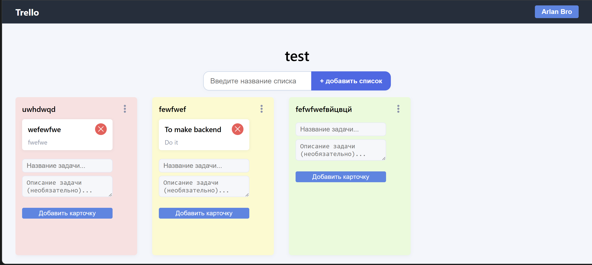
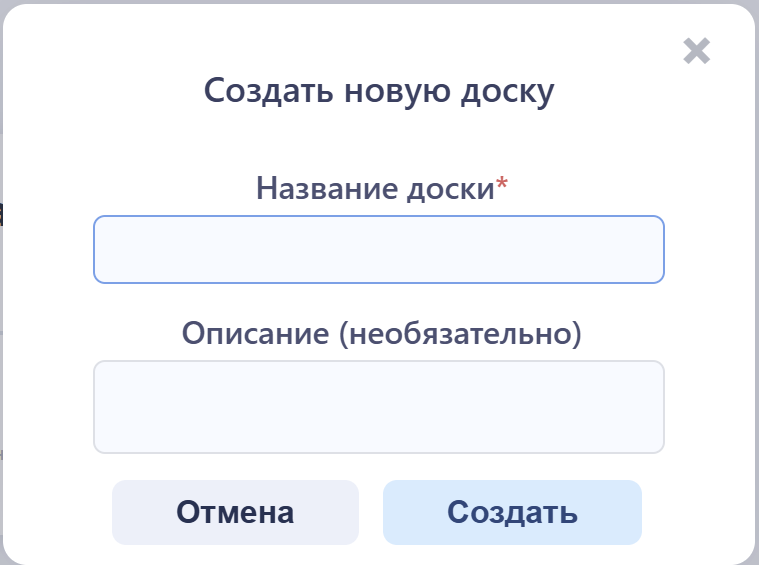
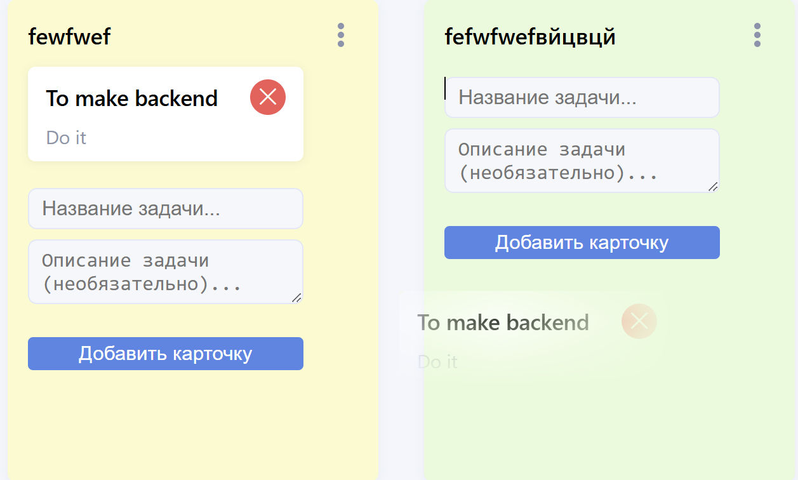

# 📋 Trello Board

<div align="center">


**Полнофункциональное веб-приложение для управления задачами с канбан-досками, реализующее логику Trello**

[Демо](#) • [Документация](#) • [Сообщить об ошибке](#)

</div>

---

## 📋 Оглавление

- [О проекте](#-о-проекте)
- [Основные возможности](#-основные-возможности)
- [Технологический стек](#-технологический-стек)
- [Архитектура проекта](#-архитектура-проекта)
- [Установка и настройка](#-установка-и-настройка)
- [Использование](#-использование)
- [Структура проекта](#-структура-проекта)
- [Скриншоты](#-скриншоты)
- [Переменные окружения](#-переменные-окружения)
- [API Документация](#-api-документация)
- [Разработка](#-разработка)
- [Лицензия](#-лицензия)

---

## 🎯 О проекте

**Trello Board** — это современное веб-приложение для управления задачами, реализующее канбан-методологию в стиле популярных трекеров задач (Trello, Jira, Monday).

Приложение позволяет эффективно организовывать работу с помощью досок, списков и карточек, обеспечивая интуитивный интерфейс и мощный функционал для управления проектами.

### 🎨 Вдохновение

Проект вдохновлен популярными системами управления задачами:
- **Trello** — за простоту и интуитивность
- **Jira** — за гибкость в организации проектов
- **Monday** — за визуальную привлекательность

---

## ✨ Основные возможности

### 🔐 Аутентификация и безопасность
- 🔑 Регистрация и авторизация пользователей
- 🎫 Token-based аутентификация через Django REST Framework
- 🔒 Разграничение прав доступа (пользователь видит только свои доски)
- 👤 Профиль пользователя с кастомной моделью User

### 📊 Управление досками
- ➕ Создание, редактирование и удаление досок
- 📝 Добавление описаний к доскам
- 🔄 Переупорядочивание досок (drag & drop)
- 📋 Отображение всех досок пользователя на главной странице

### 📝 Управление списками (колонками)
- ➕ Создание списков внутри досок
- 🎨 Цветовая маркировка списков
- ✏️ Inline-редактирование названий списков
- 🔄 Перемещение списков между позициями
- 🗑️ Удаление списков

### 🃏 Управление карточками
- ➕ Добавление карточек в списки
- ✏️ Редактирование названий и описаний карточек
- 🔄 **Drag & Drop** — перемещение карточек между списками
- 📊 Упорядочивание карточек внутри списков
- 🗑️ Удаление карточек

### 🎨 Пользовательский интерфейс
- 🪟 Модальные окна для создания/редактирования
- ⚡ Реактивный frontend без перезагрузки страницы
- 🎯 Интуитивная навигация
- 📱 Адаптивный дизайн
- 🎭 Плавные анимации и переходы

### 🏗️ Архитектурные особенности
- 🏛️ **Repository Pattern** — разделение слоя доступа к данным
- 🔧 **Service Layer** — бизнес-логика отделена от представлений
- 📦 Модульная структура кода
- 🧪 Легкое тестирование благодаря чистой архитектуре

---

## 🛠 Технологический стек

### Backend
- **Django 5.2.7** — веб-фреймворк Python
- **Django REST Framework 3.16.1** — REST API
- **PostgreSQL** — реляционная база данных
- **psycopg2-binary 2.9.11** — адаптер PostgreSQL для Python
- **python-dotenv 1.0.0** — управление переменными окружения

### Frontend
- **Vanilla JavaScript (ES6+)** — без фреймворков, чистый JS
- **HTML5** — разметка
- **CSS3** — стилизация
- **Fetch API** — HTTP-запросы к REST API

### Инструменты разработки
- **pytest 8.4.2** — тестирование
- **pytest-django 4.11.1** — интеграция pytest с Django

---

## 🏛️ Архитектура проекта

Проект следует принципам **Clean Architecture** и использует несколько ключевых паттернов:

### Repository Pattern
Логика доступа к данным вынесена в отдельные классы-репозитории:
- `core/repositories/boards.py` — работа с досками
- `core/repositories/lists.py` — работа со списками
- `core/repositories/cards.py` — работа с карточками
- `core/repositories/users.py` — работа с пользователями

**Преимущества:**
- ✅ Простая поддержка и масштабирование
- ✅ Легкая замена ORM/базы данных
- ✅ Возможность работы с мемори-репозиториями для тестов

### Service Layer
Бизнес-логика инкапсулирована в сервисных модулях:
- `core/services/auth.py` — регистрация, вход, выход
- `core/services/boards.py` — операции с досками
- `core/services/lists.py` — операции со списками
- `core/services/cards.py` — операции с карточками

### View Layer
Представления (Views) используют сервисы и репозитории:
- `core/views/auth_views.py` — аутентификация
- `core/views/board_views.py` — CRUD досок
- `core/views/list_views.py` — CRUD списков
- `core/views/card_views.py` — CRUD карточек

---

## 🚀 Установка и настройка

### Предварительные требования

- **Python** 3.8+
- **PostgreSQL** 12+ (установленный и запущенный)
- **pip** (менеджер пакетов Python)
- **pgAdmin 4** (опционально, для управления БД)

### Шаги установки

1. **Клонируйте репозиторий**
   ```bash
   git clone https://github.com/ArekeZh/Trello.git
   cd trello
   ```

2. **Создайте виртуальное окружение**
   ```bash
   python -m venv venv
   
   # Windows
   venv\Scripts\activate
   
   # Linux/Mac
   source venv/bin/activate
   ```

3. **Установите зависимости**
   ```bash
   pip install -r requirements.txt
   ```

4. **Настройте базу данных PostgreSQL**
   
   Создайте базу данных в pgAdmin 4 или через командную строку:
   ```sql
   CREATE DATABASE trello_web_db;
   ```
   
   Или используйте существующую базу данных.

5. **Настройте переменные окружения**
   
   Создайте файл `.env` в корне проекта:
   ```env
   SECRET_KEY=your-secret-key-here-generate-with-django-secret-key-generator
   DEBUG=True
   ALLOWED_HOSTS=localhost,127.0.0.1
   DB_NAME=trello_web_db
   DB_USER=postgres
   DB_PASSWORD=your_postgres_password
   DB_HOST=localhost
   DB_PORT=5432
   ```
   
   **⚠️ Важно:** Замените значения на свои реальные данные!

6. **Примените миграции**
   ```bash
   python manage.py migrate
   ```
   
   Это создаст все необходимые таблицы в базе данных.

7. **Создайте суперпользователя (опционально)**
   ```bash
   python manage.py createsuperuser
   ```
   
   Это позволит вам зайти в админ-панель Django.

8. **Запустите сервер разработки**
   ```bash
   python manage.py runserver
   ```

9. **Откройте в браузере**
   
   Приложение будет доступно по адресу `http://localhost:8000`

---

## 📖 Использование

### Первый запуск

1. **Регистрация**
   - Откройте приложение в браузере
   - Нажмите "Register" для создания нового аккаунта
   - Заполните форму регистрации (username, email, password)

2. **Вход**
   - Используйте email и password для входа
   - После успешного входа вы получите токен авторизации

3. **Создание доски**
   - На главной странице нажмите "+ Создать новую доску"
   - Заполните название и описание (опционально)
   - Сохраните доску

4. **Работа с доской**
   - Откройте доску, кликнув на неё
   - Создайте списки (колонки) для организации задач
   - Добавьте карточки в списки
   - Используйте drag & drop для перемещения карточек между списками

5. **Редактирование**
   - Кликните на название списка для inline-редактирования
   - Используйте модальные окна для редактирования досок и карточек
   - Настройте цвет списков для визуальной организации

---

## 📁 Структура проекта

```
trello/
├── core/                          # Основное приложение Django
│   ├── migrations/                # Миграции базы данных
│   │   ├── 0001_initial.py
│   │   ├── 0002_alter_user_email.py
│   │   ├── 0003_board_description.py
│   │   └── 0004_list_color.py
│   ├── repositories/              # Repository Pattern
│   │   ├── __init__.py
│   │   ├── boards.py              # Репозиторий досок
│   │   ├── cards.py               # Репозиторий карточек
│   │   ├── lists.py               # Репозиторий списков
│   │   └── users.py               # Репозиторий пользователей
│   ├── services/                  # Service Layer
│   │   ├── __init__.py
│   │   ├── auth.py                # Сервис аутентификации
│   │   ├── boards.py              # Сервис досок
│   │   ├── cards.py               # Сервис карточек
│   │   └── lists.py                # Сервис списков
│   ├── views/                     # View Layer
│   │   ├── __init__.py
│   │   ├── auth_views.py          # API аутентификации
│   │   ├── board_views.py         # API досок
│   │   ├── card_views.py          # API карточек
│   │   └── list_views.py          # API списков
│   ├── models.py                  # Модели данных (User, Board, List, Card)
│   ├── serializers.py             # DRF сериализаторы
│   ├── permissions.py             # Кастомные разрешения
│   ├── urls.py                    # URL-маршруты API
│   ├── admin.py                   # Настройки админ-панели
│   └── tests.py                   # Тесты
├── trello/                        # Настройки проекта Django
│   ├── __init__.py
│   ├── settings.py                # Конфигурация Django
│   ├── urls.py                    # Главные URL-маршруты
│   ├── wsgi.py                    # WSGI конфигурация
│   └── asgi.py                    # ASGI конфигурация
├── templates/                     # HTML шаблоны
│   ├── base.html                  # Базовый шаблон
│   ├── home.html                  # Главная страница (список досок)
│   └── board_detail.html          # Страница доски
├── static/                        # Статические файлы
│   ├── css/
│   │   ├── trello.css            # Стили для страницы доски
│   │   └── trelloMainPage.css     # Стили для главной страницы
│   └── js/
│       ├── auth.js               # Логика аутентификации
│       ├── home.js               # Логика главной страницы
│       ├── board_detail.js       # Логика страницы доски
│       ├── trello.js             # Drag & Drop функционал
│       └── trelloMainPage.js     # Дополнительная логика
├── screenshots/                   # Скриншоты приложения
│   ├── home.png                   # Главная страница
│   ├── board.png                  # Страница доски
│   ├── create-board.png           # Создание доски
│   ├── edit-card.png             # Редактирование карточки
│   └── drag-drop.png             # Drag & Drop
├── .env                           # Переменные окружения (не в Git)
├── .gitignore                     # Игнорируемые файлы Git
├── manage.py                      # Django management script
├── requirements.txt               # Python зависимости
└── README.md                      # Документация
```

---

## 📸 Скриншоты

### Главная страница (Список досок)


Главная страница отображает все доски пользователя в виде карточек. Здесь можно создавать новые доски, редактировать существующие и удалять их через модальные окна.

### Страница доски (Канбан)


Канбан-доска с списками (колонками) и карточками. Поддерживается drag & drop для перемещения карточек между списками и переупорядочивания списков.

### Модальное окно создания доски


Модальное окно для создания новой доски с полями для названия и описания.

### Модальное окно редактирования карточки


Модальное окно для редактирования карточки с возможностью изменения названия и описания.

### Drag & Drop в действии


Интерактивное перемещение карточек между списками с визуальной обратной связью.

---

## 🔐 Переменные окружения

Проект использует следующие переменные окружения (хранятся в файле `.env`):

| Переменная | Описание | Обязательная | Пример |
|-----------|----------|--------------|--------|
| `SECRET_KEY` | Секретный ключ Django для криптографии | Да | `django-insecure-...` |
| `DEBUG` | Режим отладки (True/False) | Да | `True` |
| `ALLOWED_HOSTS` | Разрешенные хосты (через запятую) | Да | `localhost,127.0.0.1` |
| `DB_NAME` | Имя базы данных PostgreSQL | Да | `trello_web_db` |
| `DB_USER` | Пользователь PostgreSQL | Да | `postgres` |
| `DB_PASSWORD` | Пароль пользователя PostgreSQL | Да | `your_password` |
| `DB_HOST` | Хост базы данных | Да | `localhost` |
| `DB_PORT` | Порт базы данных | Да | `5432` |

**⚠️ Важно:** 
- Никогда не коммитьте файл `.env` в Git! Он уже добавлен в `.gitignore`.
- Для production используйте сильный `SECRET_KEY` и установите `DEBUG=False`.

---

## 📡 API Документация

### Аутентификация

#### Регистрация
```http
POST /api/auth/register/
Content-Type: application/json

{
  "username": "user123",
  "email": "user@example.com",
  "password": "securepassword"
}
```

**Ответ:**
```json
{
  "token": "abc123...",
  "user": {
    "id": 1,
    "username": "user123",
    "email": "user@example.com"
  }
}
```

#### Вход
```http
POST /api/auth/login/
Content-Type: application/json

{
  "email": "user@example.com",
  "password": "securepassword"
}
```

#### Выход
```http
POST /api/auth/logout/
Authorization: Token abc123...
```

#### Получить профиль
```http
GET /api/auth/me/
Authorization: Token abc123...
```

### Доски (Boards)

#### Список досок
```http
GET /api/boards/
Authorization: Token abc123...
```

#### Создать доску
```http
POST /api/boards/
Authorization: Token abc123...
Content-Type: application/json

{
  "title": "Моя доска",
  "description": "Описание доски"
}
```

#### Обновить порядок доски
```http
PATCH /api/boards/{id}/reorder/
Authorization: Token abc123...
Content-Type: application/json

{
  "order": 2
}
```

### Списки (Lists)

#### Список списков доски
```http
GET /api/lists/?board={board_id}
Authorization: Token abc123...
```

#### Создать список
```http
POST /api/lists/
Authorization: Token abc123...
Content-Type: application/json

{
  "title": "Новый список",
  "board": 1,
  "color": "#FF5733"
}
```

### Карточки (Cards)

#### Список карточек списка
```http
GET /api/cards/?list={list_id}
Authorization: Token abc123...
```

#### Создать карточку
```http
POST /api/cards/
Authorization: Token abc123...
Content-Type: application/json

{
  "title": "Новая карточка",
  "description": "Описание",
  "list": 1
}
```

#### Переместить карточку
```http
PATCH /api/cards/{id}/move/
Authorization: Token abc123...
Content-Type: application/json

{
  "list": 2
}
```

---

## 🔧 Разработка

### Доступные команды

```bash
# Запуск сервера разработки
python manage.py runserver

# Применение миграций
python manage.py migrate

# Создание миграций после изменения моделей
python manage.py makemigrations

# Создание суперпользователя
python manage.py createsuperuser

# Запуск тестов
pytest

# Открытие Django shell
python manage.py shell

# Открытие shell базы данных
python manage.py dbshell
```

### Рекомендации по разработке

- ✅ Следуйте принципам Clean Architecture
- ✅ Используйте Repository Pattern для доступа к данным
- ✅ Выносите бизнес-логику в сервисный слой
- ✅ Пишите тесты для критичной функциональности
- ✅ Коммитьте изменения небольшими порциями с понятными сообщениями
- ✅ Используйте ESLint/Prettier для JavaScript (если настроено)
- ✅ Документируйте сложную логику

### Структура коммитов

Рекомендуемый формат сообщений коммитов:
```
feat: добавлена возможность переупорядочивания списков
fix: исправлена ошибка при drag & drop карточек
refactor: рефакторинг сервиса аутентификации
docs: обновлена документация API
```

---

## 🧪 Тестирование

Проект использует `pytest` и `pytest-django` для тестирования.

```bash
# Запуск всех тестов
pytest

# Запуск тестов с покрытием
pytest --cov=core

# Запуск конкретного теста
pytest core/tests.py::test_specific_function
```

---

## 🤝 Вклад в проект

Вклады приветствуются! Если вы хотите внести свой вклад:

1. Форкните репозиторий
2. Создайте ветку для новой функции (`git checkout -b feature/AmazingFeature`)
3. Закоммитьте изменения (`git commit -m 'feat: Add some AmazingFeature'`)
4. Запушьте в ветку (`git push origin feature/AmazingFeature`)
5. Откройте Pull Request

---

## 📝 Лицензия

Этот проект распространяется под лицензией MIT. См. файл `LICENSE` для подробностей.

---

## 👤 Автор

**Arlan Zhakanov**

- GitHub: [ArekeZh](https://github.com/ArekeZh)
- Email: areke.zhake@gmail.com

---

## 🙏 Благодарности

- [Django](https://www.djangoproject.com) за мощный веб-фреймворк
- [Django REST Framework](https://www.django-rest-framework.org) за отличный инструментарий для REST API
- [PostgreSQL](https://www.postgresql.org) за надежную базу данных
- [Trello](https://trello.com) за вдохновение и идеи

---

## 🎯 Планы на будущее

- [ ] Добавление комментариев к карточкам
- [ ] Прикрепление файлов к карточкам
- [ ] Уведомления и дедлайны
- [ ] Совместная работа над досками (sharing)
- [ ] История изменений
- [ ] Экспорт данных в различные форматы
- [ ] Мобильное приложение

---

<div align="center">

**⭐ Если проект вам понравился, поставьте звезду! ⭐**

Сделано с ❤️ используя Django и PostgreSQL

</div>
